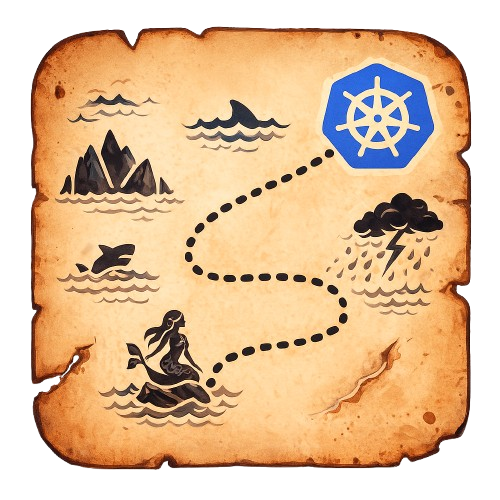

<p align="center">
 
</p>


# Kronicle
> ChatOps Monitoring for Kubernetes Deployments

[](https://artifacthub.io/packages/helm/kronicle/kronicle)


Kronicle allows you to enable/disable event changes of a service, during a deployment, from slack!

# Setup


# Configuration


# Developer Notes
Install development onto minikube by running:

```bash
helm upgrade --install kronicle charts/kronicle --set image.tag=main --set image.pullPolicy=Always
```